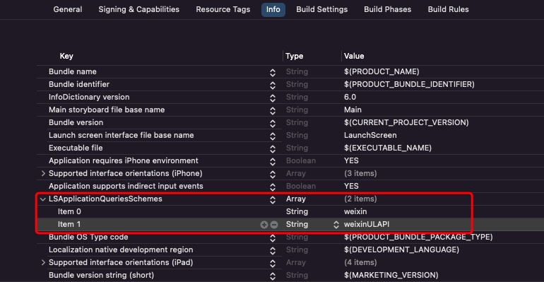
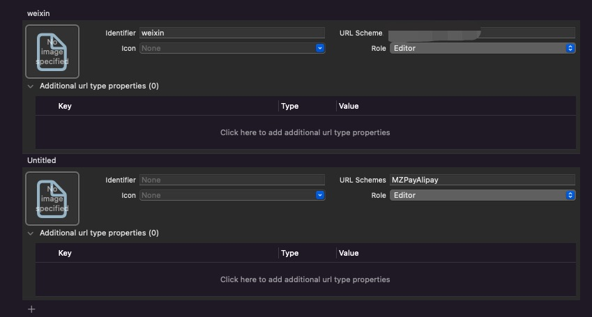

# MZPay
Swift微信支付和支付宝支付

#### Cocoapods 引入
```
pod 'MZPay', '~> 0.0.1'
```

#### 使用前提
前往微信开放平台和支付宝开放平台申请支付权限

[微信开放平台](https://open.weixin.qq.com/cgi-bin/frame?t=home/app_tmpl&lang=zh_CN)
[支付宝开放平台](https://opendocs.alipay.com/open/03k9zr)

#### 一、项目配置
- InfoPlist添加微信白名单
```
LSApplicationQueriesSchemes
	weixin
	weixinULAPI
```
<div align=center>

</div>

- 添加URL Schemes
<div align=center>

</div>


#### 二、注册微信SDK
```
MZPay.registerWechat(appid: "", universalLink: "")
```

#### 三、在AppDelegate中调用如下方法
```
func application(_ application: UIApplication, open url: URL, sourceApplication: String?, annotation: Any) -> Bool {
    let result = MZPay.handleOpenURL(url)
    if result {
        return result
    }
    return false
}

func application(_ application: UIApplication, continue userActivity: NSUserActivity, restorationHandler: @escaping ([UIUserActivityRestoring]?) -> Void) -> Bool {
    let result = MZPay.handleOpenUniversalLink(userActivity)
    if result {
        return result
    }
    return false
}
```

#### 四、调用支付接口
- 微信支付
```
MZPay.payWechat(mchid: "", prepayId: "", appid: "", appKey: "") {
    NSLog("支付成功")
} failure: { reason in
    NSLog("支付失败")
}
```

- 支付宝支付
```
MZPay.payAli(payURL: "", appScheme: "") {
    NSLog("支付成功")
} failure: { reason in
    NSLog("支付失败")
}
```